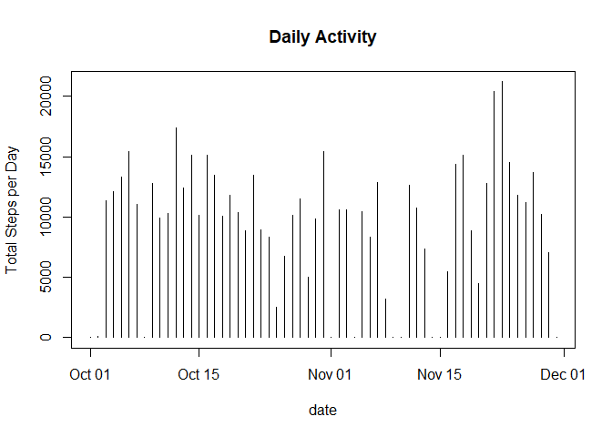
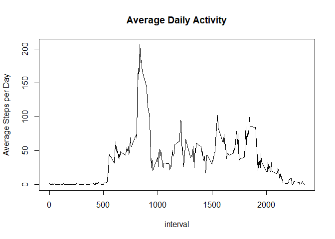
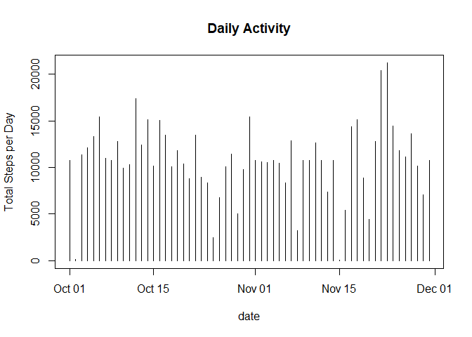
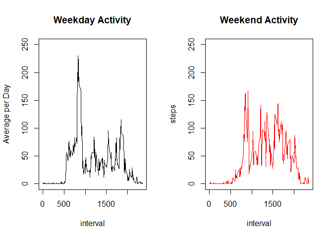

## Loading and preprocessing the data

```r
#Deploy libraries
library(dplyr)
library(lubridate)
#library(impute)

#Set working directory on local device
setwd("C:/Post_School/Coursera/Data_Science/reproducible-research/repdata_data_activity")

#Load data from file
repData <- read.csv("./activity.csv")

#Convert factor into date format
repData$date <- ymd(repData$date)
```


## What is mean total number of steps taken per day?

```r
#Group by date
stepSumData <- repData %>% group_by(date) %>% summarize(steps = sum(steps, na.rm=TRUE))

#Plot histogram
with(stepSumData,plot(date, steps,type="h",main="Daily Activity", ylab="Total Steps per Day"))
```

<!-- -->

```r
#Calculate mean & median steps per day
mean_steps <- mean(stepSumData$steps)
mean_steps <- round(mean_steps)
median_steps <- median(stepSumData$steps)
median_steps <- round(median_steps)
```

**Mean steps per day: 9354**

**Median steps per day: 1.0395\times 10^{4}**

## What is the average daily activity pattern?

```r
#Group by interval
intervalData <- repData %>% group_by(interval) %>% summarize(steps = mean(steps, na.rm=TRUE))

#Plot time-series
with(intervalData, plot(interval, steps, type="l",main="Average Daily Activity",ylab="Average Steps per Day"))
```

<!-- -->

```r
#Determine peak activity
intervalData <- as.data.frame(intervalData)

max_interval <- intervalData[which.max(intervalData$steps),1]
```

**Peak activity occurs at 835** 

## Imputing missing values

```r
#Calculate rows with missing values
NA_rows <- sum(is.na(repData$steps))
NA_rows <- round(NA_rows)

#Impute missing values
impData <- repData %>% group_by(interval) %>% mutate(steps=ifelse(is.na(steps), mean(steps, na.rm=TRUE), steps))

#Group by date
stepSumData2 <- impData %>% group_by(date) %>% summarize(steps = sum(steps, na.rm=TRUE))

#Plot histogram
with(stepSumData2,plot(date, steps,type="h",main="Daily Activity", ylab="Total Steps per Day"))
```

<!-- -->

```r
#Calculate mean & median steps per day
mean_steps_2 <- mean(stepSumData2$steps)
mean_steps_2 <- round(mean_steps_2)
median_steps_2 <- median(stepSumData2$steps)
median_steps_2 <- round(median_steps_2)
```

**Number of rows with missing values: 2304**

**Mean steps per day: 1.0766\times 10^{4}**

**Median steps per day: 1.0766\times 10^{4}**

**Imputing missing values increases both the mean and median steps per day.**  

## Are there differences in activity patterns between weekdays and weekends?

```r
#Create vector of weekdays
wdays <- c('Monday', 'Tuesday', 'Wednesday', 'Thursday', 'Friday')

#Create dataset with day of week factors
wdayData <- impData %>% mutate(day = factor(weekdays(date) %in% wdays, levels=c(TRUE, FALSE), labels=c('weekday','weekend')))

#Group by interval
wdayData2 <- wdayData %>% group_by(day, interval) %>% summarize(steps = mean(steps))

#Plot time series
par(mfrow=c(1,2))
with(subset(wdayData2, day=="weekday"), plot(interval, steps, type="l", col="black", main="Weekday Activity", ylim=c(0,250),ylab="Average per Day"))
with(subset(wdayData2, day=="weekend"), plot(interval, steps, type="l", col="red", main="Weekend Activity", ylim=c(0,250)))
```

<!-- -->

**Peak activity is higher on weekdays, but on average, the weekends have greater activity.**   
